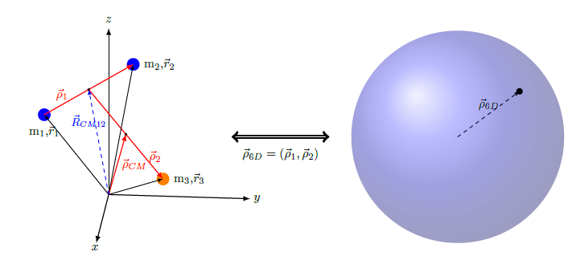
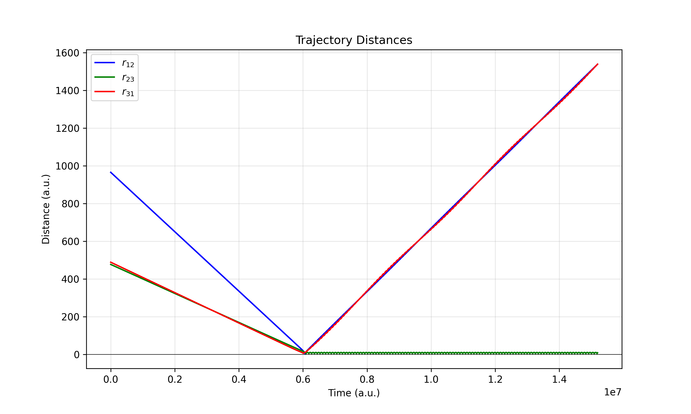
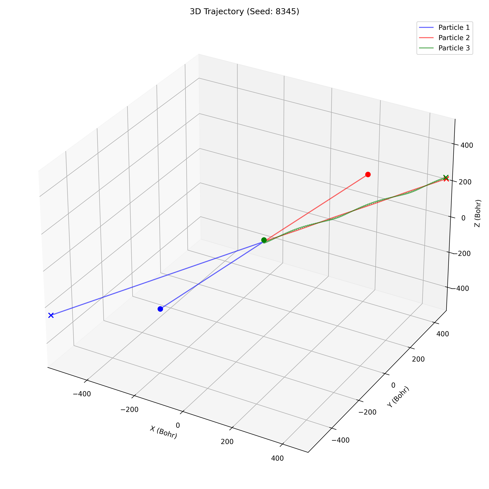

# Py3BR (Python 3-Body Recombination)
 Python package for classical trajectory simulations of direct three-body atomic collisions for calculating the rate of recombination, which occurs when two atoms form a molecule and the third atom carries away the excess energy required to create the bond. For a collision of type $A + B + C$, the result may be:
1. Reaction (n12): $AB + B$
2. Reaction (n23): $BC + A$
3. Reaction (n31): $CA + B$
4. Dissociation (nd): $A + B + C$

## Installation
In a fresh virtual environment, navigate to the root directory of the repository and run 

`pip install . ` 

## Theory
We transform the three-dimensional scattering problem into a six-dimensional hyperspherical coordinate space, which translates the problem of three scattering particles to just one. In this space, the scattering cross section is clearly defined and we generate an accurate sampling of initial conditions for the simulations. The trajectories are propagated using Hamilton's equations of motion, after which bound states are identified. The number of trajectories ending in each of the four possibilities is counted, and written to the output file. 



## Plotters
To visualize the collisions, we provide several plotter tools:

2D Trajectory plot (`plot_distances()`) to trace the relative distance between each particle. For a reaction A + B + C, $r_{12}$ represents the distance between particle A and B. In this plot, the molecule BC is formed:


3D plot (`plot_3d_motion()`) to trace the 3D motion of the collision in the center of mass frame. For a reaction A + B + C, Particle 1 represents A. In this plot, the molecule BC is formed:



<!-- $$ k_{\text{rec}}(T) = \frac{1}{2(k_bT)^3}\int_0^\infty \sqrt{\frac{2E_c}{\mu}}\sigma_{\text{rec}}(E_c)E_c^2e^{-E_c/(k_bT)}dE_c$$ -->


## Usage
### Input
All input parameters are in atomic units, except for collision energy which is in Kelvin. The following should be specified for a given trajectory:

`task_data` = `m1, m2, m3, E0, b0, R0, v_funcs, dv_funcs, seed`

where `m1,m2,m3` are the masses, `E0` is the collision energy, `b0` is the impact parameter, `R0` is the initial hyperradius, `v_funcs` is a tuple of the three interaction energies (v12, v23, v31), `dv_funcs` is a tuple of the derivative of the three interaction energies (dv12, dv23, dv31), and `seed` is the random number generator seed. 

### Running trajectories
To run one trajectory, run:

`tbr.simulator.run_trajectory_worker(task_data=task_data)`

To scan a range of impact parameters for a given collision energy, run:

```python
b_values = np.arange(0, 500, 25)
    try:
        run_b_scan(
            b_range=b_values, num_traj_per_b=10000,
            masses=masses, E0=E0, R0=R0, v_funcs=v_funcs,
            dv_funcs=dv_funcs,
            summary_file=f'results.csv',
            save_detailed=False
        )
    except RuntimeError as e:
        print(f'Multiprocessing error: {e}')
```

If set to `True`, the `save_detailed` option saves each individual trajectory as a numpy file in a directory called `trajectories` for further analysis. 
### Output
The collision energy is reported in Kelvin, just as in the input. All other attributes are in atomic units. The opacity function is a unitless probability, the cross section is in $`\mathrm{cm^5}`$, and the three-body recombination rate is in $`\mathrm{cm^6/s}`$.

For a given set of initial conditions, the program will output a csv file with the header:

 `E0,b0,n12,n23,n31,nd,nc,rej,time`

Which represents the collision energy, impact parameter, number of AB reactions, BC reactions, CA reactions, dissociation events, and rejected trajectories. The time column reports the total calculation time.

## Analysis
From the resulting statistics, it is straightforward to compute the scattering observables such as opacity, cross section, and rate coefficient for a given collision energy. The analysis module provides functions to calculate these observables as a function of energy.

<u>Units:</u> 
- `opacity()` : Unitless probability
- `cross_section()`: cm $^5$
- `rate()`: cm $^6$/s

From the energy-dependent rate, the thermal rate coefficient is calculated over the three-body Maxwell-Boltzmann energy distribution using the function `thermal_rate()`.

## Related Publications
- Py3BR
- Sulfur
- He+ 
- Halogens
- Dan's ML paper
## License
 
[MIT](https://choosealicense.com/licenses/mit/)
